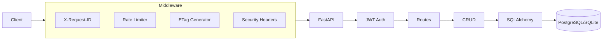
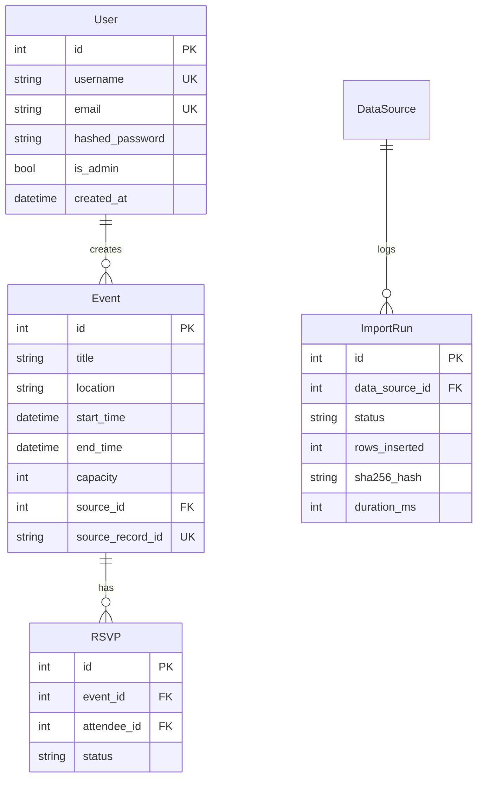

# COMP3011 Technical Report: EventHub API

**Module:** COMP3011 – Web Services and Web Data  
**Student:** Nathaniel Sebastian (sc232ns)  
**Date:** 5th February 2026  
**Word Count:** ~1,400 words

---

## Submission Links

| Resource | Link |
|----------|------|
| GitHub Repository | [github.com/NathS04/comp3011-cw1-api](https://github.com/NathS04/comp3011-cw1-api) |
| Live API | [comp3011-cw1-api.onrender.com](https://comp3011-cw1-api.onrender.com) |
| API Documentation | [docs/API_DOCUMENTATION.pdf](docs/API_DOCUMENTATION.pdf) |
| Presentation Slides | [docs/PRESENTATION_SLIDES.pptx](docs/PRESENTATION_SLIDES.pptx) |
| GenAI Logs | [docs/GENAI_EXPORT_LOGS.pdf](docs/GENAI_EXPORT_LOGS.pdf) |

---

## 1. Compliance Checklist

| Requirement | Status | Location |
|-------------|--------|----------|
| GitHub repository | ✅ | github.com/NathS04/comp3011-cw1-api |
| API documentation PDF | ✅ | `docs/API_DOCUMENTATION.pdf` |
| Technical report PDF | ✅ | `TECHNICAL_REPORT.pdf` |
| Presentation slides | ✅ | `docs/PRESENTATION_SLIDES.pptx` |
| GenAI logs | ✅ | `docs/GENAI_EXPORT_LOGS.pdf` |
| README.md | ✅ | Root directory |
| Deployed API | ✅ | comp3011-cw1-api.onrender.com |
| Novel data integration | ✅ | Leeds TEN XML with SHA256 provenance |
| Authentication | ✅ | JWT + PBKDF2 |
| Test suite | ✅ | 39 tests passing |

---

## 2. Reproducibility

```bash
git clone https://github.com/NathS04/comp3011-cw1-api.git && cd comp3011-cw1-api
python3 -m venv venv && source venv/bin/activate
pip install -r requirements.txt
export DATABASE_URL="sqlite:///./app.db" SECRET_KEY="dev-secret"
alembic upgrade head
pytest -q                    # Expected: 39 passed
uvicorn app.main:app --reload
```

---

## 3. Dataset Provenance

| Attribute | Value |
|-----------|-------|
| Source | Leeds Temporary Event Notices |
| Provider | Leeds City Council (Data Mill North) |
| Licence | Open Government Licence v3.0 |
| Format | XML |
| Fields Mapped | Reference_Number → ID, Premises_Name → Title |
| Provenance | SHA256 hash stored in ImportRun table |

---

## 4. Architecture



---

## 5. Data Model (ERD)



---

## 6. Security Model

| Threat | Mitigation | Implementation |
|--------|------------|----------------|
| Credential theft | PBKDF2-SHA256 hashing | `passlib` |
| Token forgery | HS256 signed JWT | `python-jose` |
| Privilege escalation | RBAC | `is_admin` flag; 403 on `/admin/*` |
| DoS | Rate limiting | 120/min global, 10/min login |
| Request correlation | Request ID | `X-Request-ID` on all responses |
| Clickjacking | Security headers | `X-Frame-Options: DENY` |
| MIME sniffing | Security headers | `X-Content-Type-Options: nosniff` |
| Caching sensitive data | Cache-Control | `no-store` (default) |
| Bandwidth waste | ETag caching | `If-None-Match` → 304 |
| Error leakage | Sanitized 500s | Generic message + request_id only |

---

## 7. Design Decisions & Trade-offs

| Decision | Alternative | Trade-off | Justification |
|----------|-------------|-----------|---------------|
| In-memory rate limiting | Redis | Single-process only | Acceptable for coursework; documented limitation |
| ETag via body hash | DB updated_at | Recalculates on each request | Simpler; no schema changes |
| JWT (no refresh) | Refresh tokens | 30-min sessions | Simpler for coursework scope |
| SQLite/Postgres dual | Postgres-only | Dev simplicity | Alembic handles dialect |

---

## 8. Testing Strategy

| Category | Count | Coverage |
|----------|-------|----------|
| Auth | 6 | Register, login, validation |
| Events CRUD | 5 | Create, read, update, delete, pagination |
| RSVPs | 4 | Create, duplicate rejection |
| Analytics | 4 | Seasonality, trending, recommendations |
| Admin/Import | 3 | Idempotency, provenance |
| RBAC | 2 | 403 for non-admin |
| Middleware | 2 | Headers, rate limiting |
| Attendees | 4 | CRUD, uniqueness |
| Health | 1 | Returns metadata |
| ETag | 3 | Generation, 304, mismatch |
| Error Handling | 1 | Sanitization |
| **Total** | **39** | |

Test isolation: In-memory SQLite with `StaticPool`; tables created/dropped per test.

---

## 9. Deployment

**Platform:** Render.com  
**Database:** Managed PostgreSQL  
**Config:** `render.yaml`  
**Variables:** `DATABASE_URL`, `SECRET_KEY`, `ENVIRONMENT=prod`

---

## 10. Version Control

See GitHub commit history for incremental development evidence.

[Insert screenshot of commit history]

---

## 11. GenAI Usage

**Tools:** Google Gemini (Antigravity), Claude, ChatGPT

**Creative Applications:**
1. Compared RSVP storage approaches (embedded vs relational)
2. Evaluated rate limiting options (in-memory vs Redis)
3. Researched ETag/If-None-Match RFC 7232 compliance

**Failures Caught:**
- Missing `requests` dependency
- Placeholder test with `pass`
- Deprecated `Query(regex=...)` syntax

Full logs: [docs/GENAI_EXPORT_LOGS.pdf](docs/GENAI_EXPORT_LOGS.pdf)

---

## 12. Limitations & Future Work

| Limitation | Fix |
|------------|-----|
| No token refresh | Implement refresh tokens |
| In-memory rate limiting | Redis-backed |
| No CSP header | Add Content-Security-Policy |

---

## References

[1] UK Government, "Open Government Licence v3.0"  
[2] Auth0, "JWT Best Practices"  
[3] MDN, "ETag" (RFC 7232)  
[4] FastAPI Documentation  

---

*COMP3011 CW1, University of Leeds*
