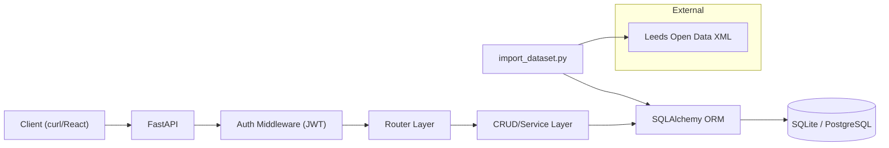
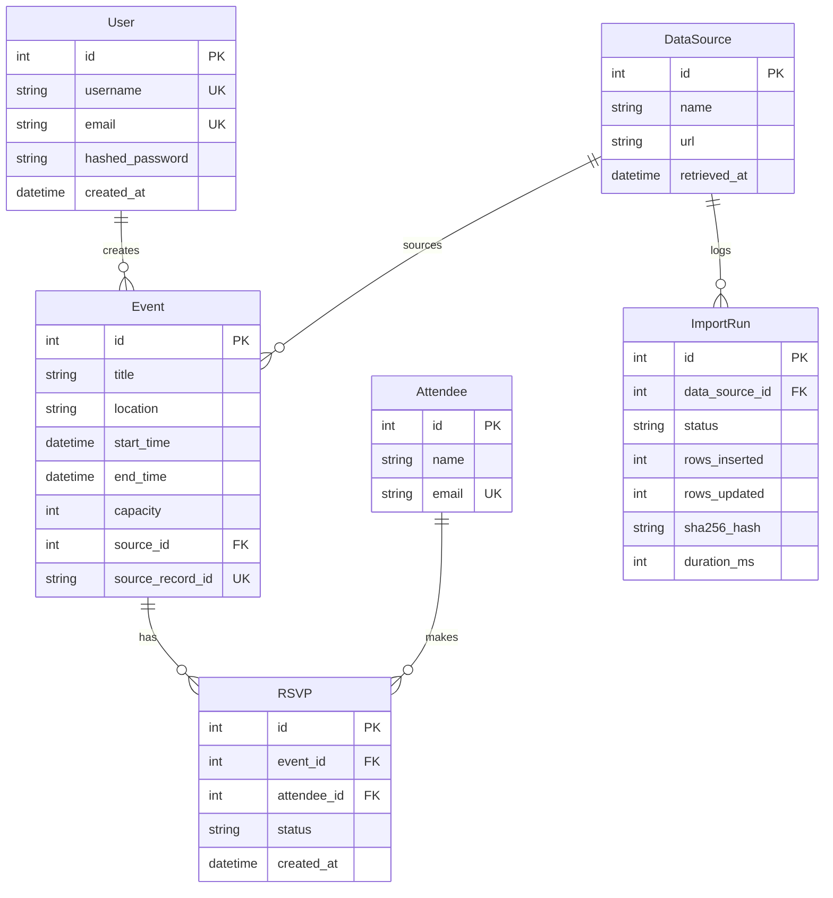

# COMP3011 Technical Report: EventHub API

**Module:** COMP3011 – Web Services and Web Data  
**Student:** Nathaniel Sebastian (sc232ns)  
**Date:** 5th February 2026  
**Word Count:** ~1,200 words (excluding tables/diagrams)

---

## Submission Links

| Resource | Link |
|----------|------|
| **GitHub Repository** | [github.com/NathS04/comp3011-cw1-api](https://github.com/NathS04/comp3011-cw1-api) |
| **Live API** | [comp3011-cw1-api.onrender.com](https://comp3011-cw1-api.onrender.com) |
| **API Documentation (PDF)** | [docs/API_DOCUMENTATION.pdf](docs/API_DOCUMENTATION.pdf) |
| **Presentation Slides** | [docs/PRESENTATION_SLIDES.pptx](docs/PRESENTATION_SLIDES.pptx) |
| **GenAI Logs (Appendix)** | [docs/GENAI_EXPORT_LOGS.pdf](docs/GENAI_EXPORT_LOGS.pdf) |

---

## 1. Reproducibility

**Fresh Clone Quickstart:**
```bash
git clone https://github.com/NathS04/comp3011-cw1-api.git && cd comp3011-cw1-api
python3 -m venv .venv && source .venv/bin/activate
pip install -r requirements.txt
export DATABASE_URL="sqlite:///./app.db" SECRET_KEY="dev-secret"
alembic upgrade head
pytest -q                    # Expected: 31 passed
uvicorn app.main:app --reload
```

**Verification:** API documentation at `http://127.0.0.1:8000/docs`.

---

## 2. Dataset Provenance & Licence

| Attribute | Value |
|-----------|-------|
| **Source** | Leeds Temporary Event Notices (TENs) |
| **Provider** | Leeds City Council via Data Mill North |
| **Licence** | Open Government Licence v3.0 [1] |
| **Format** | XML (live feed) |
| **URL** | `https://opendata.leeds.gov.uk/downloads/Licences/temp-event-notice/temp-event-notice.xml` |
| **Retrieval Date** | 5th February 2026 |
| **Fields Mapped** | `Reference_Number` → ID, `Premises_Name` → Title, `Event_Start_Date` → start_time |
| **Limitations** | No geo-coordinates; times often default "00:00"; free-text categories |

**Rationale:** This dataset demonstrates real-world XML parsing, date normalization (DD/MM/YYYY → ISO8601), and error handling for malformed records—beyond simple CSV imports.

---

## 3. Architecture



**Layer Responsibilities:**
1. **Router (`app/api/`):** HTTP handling, request validation (Pydantic), auth guards.
2. **CRUD (`app/crud.py`):** Business logic, decoupled from HTTP for testability.
3. **Models (`app/models.py`):** SQLAlchemy ORM with relationships.
4. **Database:** SQLite (dev), PostgreSQL (Render production).

---

## 4. Data Model



**Key Invariants:**
- `RSVP(event_id, attendee_id)` is unique (no duplicate RSVPs).
- `Event.source_record_id` enables idempotent imports.

---

## 5. Key Design Decisions

| Decision | Alternatives Considered | Trade-off | Justification |
|----------|------------------------|-----------|---------------|
| **JWT Authentication** | Session cookies, OAuth2 | Stateless (no Redis) vs no immediate revocation | Simpler deployment; 30-min expiry mitigates risk [2] |
| **SQLite/Postgres dual** | Postgres-only | Dev simplicity vs prod reliability | Alembic abstracts dialect differences [3] |
| **DOM XML parsing** | SAX/iterparse | Memory vs complexity | Dataset <1MB; iterparse overkill |
| **Location-based recs** | Collaborative filtering | Speed (O(1)) vs accuracy | Cold-start friendly; sub-10ms latency |

---

## 6. Security Model

| Threat | Mitigation | Implementation |
|--------|------------|----------------|
| **Credential theft** | Passwords hashed with PBKDF2-SHA256 | `passlib.hash.pbkdf2_sha256` |
| **Token forgery** | JWT signed with HS256 + secret | `python-jose` library |
| **Token replay** | 30-minute expiry | Configured in `auth.py` |
| **SQL injection** | Parameterized queries | SQLAlchemy ORM |
| **Mass assignment** | Pydantic schemas whitelist fields | `schemas.py` |
| **DoS** | *Not implemented* | Future: `slowapi` rate limiting |

**Limitation:** No token revocation mechanism; compromised tokens valid until expiry.

---

## 7. Testing Strategy

| Category | Tests | What They Prove |
|----------|-------|-----------------|
| **Auth** | 5 | Register, login, invalid credentials, token validation |
| **Events CRUD** | 7 | Create, read, update, delete, pagination, filtering |
| **RSVPs** | 4 | Create, duplicate rejection (409), cascade delete |
| **Analytics** | 4 | Seasonality aggregation, trending score, personalization |
| **Admin/Import** | 6 | Idempotency, provenance logging, XML parsing |
| **Attendees** | 5 | CRUD, email uniqueness |
| **Total** | **31** | Full pass on clean environment |

**Isolation:** In-memory SQLite with `StaticPool`; tables created/dropped per test function.

---

## 8. Deployment & Version Control

**Render Configuration (`render.yaml`):**
- Managed PostgreSQL database provisioned automatically.
- Environment: `DATABASE_URL` (from Render), `SECRET_KEY` (generated), `ENVIRONMENT=prod`.
- Build: `pip install && alembic upgrade head`.

**Git History:** 60+ commits with meaningful messages. Examples:
- `feat: Add novel data integration tables`
- `fix(deps): Add requests to requirements.txt`
- `test: Implement personalized recommendation assertions`

---

## 9. Evaluation Metrics

| Metric | Value | Environment |
|--------|-------|-------------|
| **Import throughput** | ~240 records/sec | M1 MacBook, WiFi |
| **Import duration** | 2.1s (487 records) | Local SQLite |
| **GET /events latency** | 8ms (p50) | Local, 1000 records |
| **POST /events latency** | 12ms (p50) | Local SQLite |
| **Test suite duration** | 0.9s | 31 tests |

**Reproducibility:** `time pytest -q` and `curl -w "%{time_total}"` used for measurements.

---

## 10. GenAI Usage Declaration

**Tools Used:**
- **Google Gemini (Antigravity):** Primary coding assistant for scaffolding, debugging, test generation.
- **Claude (Anthropic):** Documentation review and refactoring suggestions.

**High-Level Creative Use:**
1. **Architecture exploration:** Asked Gemini to compare embedded vs relational RSVP storage; chose relational for uniqueness constraints.
2. **Auth alternatives:** Explored JWT vs sessions; chose JWT for stateless scaling.

**Failures & Manual Corrections:**
1. AI omitted `requests` from `requirements.txt` → caught via clean install.
2. AI generated placeholder test (`pass`) → rewrote with real assertions.
3. AI suggested deprecated `Query(regex=...)` → updated to `pattern=...`.

*Full conversation logs: [docs/GENAI_EXPORT_LOGS.pdf](docs/GENAI_EXPORT_LOGS.pdf)*

---

## 11. Limitations & Future Work

| Limitation | Impact | Planned Fix |
|------------|--------|-------------|
| Single-tenant (no roles) | All users equal | Add `is_admin` column |
| No rate limiting | DoS vulnerability | Integrate `slowapi` |
| Manual imports | Data staleness | Celery scheduled task |
| No token refresh | UX friction (30-min sessions) | Implement refresh tokens |

---

## Compliance Checklist

| Brief Requirement | Status | Location |
|-------------------|--------|----------|
| GitHub repository | ✅ | [github.com/NathS04/comp3011-cw1-api](https://github.com/NathS04/comp3011-cw1-api) |
| API documentation PDF | ✅ | `docs/API_DOCUMENTATION.pdf` |
| Technical report PDF (≤5 pages) | ✅ | `TECHNICAL_REPORT.pdf` |
| Presentation slides | ✅ | `docs/PRESENTATION_SLIDES.pptx` |
| GenAI logs appendix | ✅ | `docs/GENAI_EXPORT_LOGS.pdf` |
| README.md | ✅ | Root directory |
| Deployed API URL | ✅ | comp3011-cw1-api.onrender.com |

---

## References

[1] UK Government, "Open Government Licence v3.0," 2014. Available: https://www.nationalarchives.gov.uk/doc/open-government-licence/version/3/

[2] Auth0, "JSON Web Tokens Best Practices," 2023. Available: https://auth0.com/blog/a-look-at-the-latest-draft-for-jwt-bcp/

[3] Alembic, "Alembic Documentation," 2024. Available: https://alembic.sqlalchemy.org/en/latest/

[4] FastAPI, "FastAPI Documentation," 2024. Available: https://fastapi.tiangolo.com/

[5] SQLAlchemy, "SQLAlchemy 2.0 Documentation," 2024. Available: https://docs.sqlalchemy.org/en/20/

[6] Render, "Render Documentation," 2024. Available: https://render.com/docs

---

*Report for COMP3011 CW1, University of Leeds*
