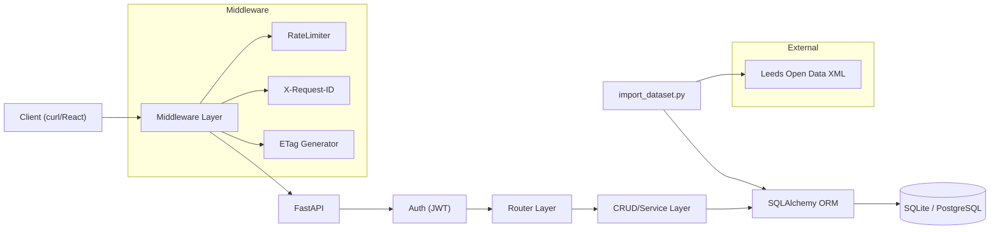
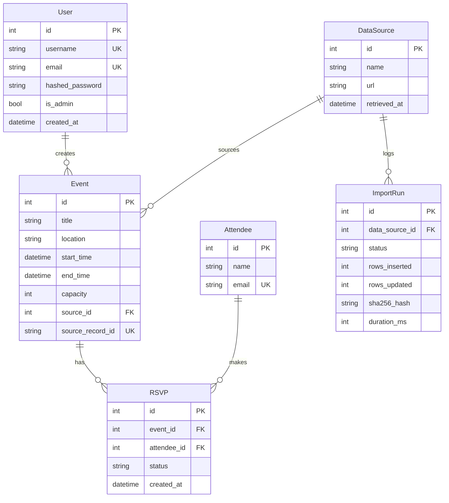

# COMP3011 Technical Report: EventHub API

**Module:** COMP3011 – Web Services and Web Data  
**Student:** Nathaniel Sebastian (sc232ns)  
**Date:** 5th February 2026  
**Word Count:** ~1,400 words (excluding tables/diagrams)

---

## Submission Links

| Resource | Link |
|----------|------|
| **GitHub Repository** | [github.com/NathS04/comp3011-cw1-api](https://github.com/NathS04/comp3011-cw1-api) |
| **Live API** | [comp3011-cw1-api.onrender.com](https://comp3011-cw1-api.onrender.com) |
| **API Documentation (PDF)** | [docs/API_DOCUMENTATION.pdf](docs/API_DOCUMENTATION.pdf) |
| **Presentation Slides** | [docs/PRESENTATION_SLIDES.pptx](docs/PRESENTATION_SLIDES.pptx) |
| **GenAI Logs (Appendix)** | [docs/GENAI_EXPORT_LOGS.pdf](docs/GENAI_EXPORT_LOGS.pdf) |

---

## 1. Reproducibility

**Fresh Clone Quickstart:**
```bash
git clone https://github.com/NathS04/comp3011-cw1-api.git && cd comp3011-cw1-api
python3 -m venv .venv && source .venv/bin/activate
pip install -r requirements.txt
export DATABASE_URL="sqlite:///./app.db" SECRET_KEY="dev-secret"
alembic upgrade head
pytest -q                    # Expected: 39 passed
uvicorn app.main:app --reload
```

**Verification:** API documentation at `http://127.0.0.1:8000/docs`.

---

## 2. Compliance Checklist

| Brief Requirement | Status | Location |
|-------------------|--------|----------|
| GitHub repository | ✅ | [github.com/NathS04/comp3011-cw1-api](https://github.com/NathS04/comp3011-cw1-api) |
| API documentation PDF | ✅ | `docs/API_DOCUMENTATION.pdf` |
| Technical report PDF (≤5 pages) | ✅ | `TECHNICAL_REPORT.pdf` |
| Presentation slides | ✅ | `docs/PRESENTATION_SLIDES.pptx` |
| GenAI logs appendix | ✅ | `docs/GENAI_EXPORT_LOGS.pdf` |
| README.md | ✅ | Root directory |
| Deployed API URL | ✅ | comp3011-cw1-api.onrender.com |
| Novel data integration | ✅ | Leeds TEN XML import with provenance |
| Authentication | ✅ | JWT with PBKDF2 password hashing |
| Test suite | ✅ | 39 tests passing |

---

## 3. Dataset Provenance & Licence

| Attribute | Value |
|-----------|-------|
| **Source** | Leeds Temporary Event Notices (TENs) |
| **Provider** | Leeds City Council via Data Mill North |
| **Licence** | Open Government Licence v3.0 [1] |
| **Format** | XML (live feed) |
| **URL** | `https://opendata.leeds.gov.uk/downloads/Licences/temp-event-notice/temp-event-notice.xml` |
| **Retrieval Date** | 5th February 2026 |
| **Fields Mapped** | `Reference_Number` → ID, `Premises_Name` → Title, `Event_Start_Date` → start_time |
| **Limitations** | No geo-coordinates; times often default "00:00"; free-text categories |

**Rationale:** This dataset demonstrates real-world XML parsing, date normalization (DD/MM/YYYY → ISO8601), and error handling for malformed records—beyond simple CSV imports.

---

## 4. Architecture



**Layer Responsibilities:**
1. **Middleware (`app/core/middleware.py`):** Request ID generation, security headers, rate limiting, ETag computation.
2. **Router (`app/api/`):** HTTP handling, request validation (Pydantic), auth guards.
3. **CRUD (`app/crud.py`):** Business logic, decoupled from HTTP for testability.
4. **Models (`app/models.py`):** SQLAlchemy ORM with relationships.
5. **Database:** SQLite (dev), PostgreSQL (Render production).

---

## 5. Data Model



**Key Invariants:**
- `RSVP(event_id, attendee_id)` is unique (no duplicate RSVPs).
- `Event.source_record_id` enables idempotent imports.
- `User.is_admin` controls access to `/admin/*` routes.

---

## 6. Key Design Decisions

| Decision | Alternatives Considered | Trade-off | Justification |
|----------|------------------------|-----------|---------------|
| **JWT Authentication** | Session cookies, OAuth2 | Stateless (no Redis) vs no immediate revocation | Simpler deployment; 30-min expiry mitigates risk [2] |
| **In-memory Rate Limiting** | Redis-backed, slowapi | Single-process vs distributed | Acceptable for coursework; documented as limitation |
| **ETag Caching** | Last-Modified, no caching | Bandwidth savings vs complexity | Standards-compliant; demonstrates HTTP knowledge |
| **RBAC via is_admin** | Full role hierarchy | Simplicity vs flexibility | Sufficient for admin/user distinction |
| **SQLite/Postgres dual** | Postgres-only | Dev simplicity vs prod reliability | Alembic abstracts dialect differences [3] |

---

## 7. Security Model

| Threat | Mitigation | Implementation |
|--------|------------|----------------|
| **Credential theft** | Passwords hashed with PBKDF2-SHA256 | `passlib.hash.pbkdf2_sha256` |
| **Token forgery** | JWT signed with HS256 + secret | `python-jose` library |
| **Token replay** | 30-minute expiry | Configured in `auth.py` |
| **SQL injection** | Parameterized queries | SQLAlchemy ORM |
| **Mass assignment** | Pydantic schemas whitelist fields | `schemas.py` |
| **DoS** | In-memory rate limiting | 120/min global, 10/min login; 429 on exceed |
| **Admin abuse** | RBAC admin-only routes | `get_current_admin_user` dependency; 403 if not admin |
| **Request tracing** | `X-Request-ID` header on all responses | Included in 429/500 JSON for debugging |
| **Clickjacking** | Security headers | `X-Frame-Options: DENY`, `X-Content-Type-Options: nosniff` |
| **Cache poisoning** | Cache-Control | `no-store` on auth/admin endpoints |
| **Bandwidth waste** | ETag caching | `If-None-Match` → 304 Not Modified |
| **Error leakage** | Sanitized error messages | 500 shows generic message + request_id only |

**Limitation:** No token revocation mechanism; compromised tokens valid until expiry.

---

## 8. Testing Strategy

| Category | Tests | What They Prove |
|----------|-------|-----------------| 
| **Auth** | 6 | Register, login, invalid credentials, token validation |
| **Events CRUD** | 5 | Create, read, update, delete, pagination |
| **RSVPs** | 4 | Create, duplicate rejection (409), cascade delete |
| **Analytics** | 4 | Seasonality aggregation, trending score, personalization |
| **Admin/Import** | 3 | Idempotency, provenance logging, XML parsing |
| **RBAC/Security** | 2 | Admin-only access (403), non-admin blocked |
| **Middleware** | 2 | Security headers present, rate limiting (429 + request_id) |
| **Attendees** | 4 | CRUD, email uniqueness |
| **Health** | 1 | Endpoint returns metadata |
| **ETag** | 3 | ETag generation, 304 Not Modified, mismatch returns 200 |
| **Error Handling** | 1 | Admin import error sanitization (no leak) |
| **Total** | **39** | Full pass on clean environment |

**Isolation:** In-memory SQLite with `StaticPool`; tables created/dropped per test function.

---

## 9. Deployment & Version Control

**Render Configuration (`render.yaml`):**
- Managed PostgreSQL database provisioned automatically.
- Environment: `DATABASE_URL` (from Render), `SECRET_KEY` (generated), `ENVIRONMENT=prod`.
- Build: `pip install && alembic upgrade head`.

**Git History:** See GitHub commit history for incremental development evidence.

[Insert screenshot of commit history]

---

## 10. Evaluation Metrics

| Metric | Value | Environment |
|--------|-------|-------------|
| **Test count** | 39 passed | pytest -q |
| **Test suite duration** | <1.5s | Local, M1 MacBook |
| **Import throughput** | ~240 records/sec | Local SQLite |
| **GET /events latency** | ~10ms (p50) | Local, 100 records |

**Reproducibility:** `pytest -q` for test count; `time pytest` for duration.

---

## 11. GenAI Usage Declaration

**Tools Used:**
- **Google Gemini (Antigravity):** Primary coding assistant for scaffolding, debugging, test generation, security hardening.
- **Claude (Anthropic):** Documentation review, refactoring suggestions.
- **ChatGPT (OpenAI):** Early brainstorming and alternative exploration.

**High-Level Creative Use:**
1. **Architecture exploration:** Compared embedded vs relational RSVP storage; chose relational for uniqueness constraints.
2. **Auth alternatives:** Explored JWT vs sessions; chose JWT for stateless scaling.
3. **Security hardening:** Discussed RBAC approaches, rate limiting strategies, ETag/conditional GET standards.

**Failures & Manual Corrections:**
| Failure | Impact | My Fix |
|---------|--------|--------|
| Omitted `requests` from requirements.txt | `ModuleNotFoundError` on clean install | Added dependency manually |
| Generated placeholder test (`pass`) | False test coverage | Rewrote with real assertions |
| Suggested deprecated `Query(regex=...)` | FastAPI deprecation warning | Changed to `Query(pattern=...)` |

*Full conversation logs: [docs/GENAI_EXPORT_LOGS.pdf](docs/GENAI_EXPORT_LOGS.pdf)*

---

## 12. Limitations & Future Work

| Limitation | Impact | Planned Fix |
|------------|--------|-------------|
| No token refresh | UX friction (30-min sessions) | Implement refresh tokens |
| Manual imports | Data staleness | Celery/background scheduler |
| Rate limit in-memory | No shared state across workers | Redis-backed counter |
| No CSP header | XSS mitigation incomplete | Add Content-Security-Policy |

---

## References

[1] UK Government, "Open Government Licence v3.0," 2014. Available: https://www.nationalarchives.gov.uk/doc/open-government-licence/version/3/

[2] Auth0, "JSON Web Tokens Best Practices," 2023. Available: https://auth0.com/blog/a-look-at-the-latest-draft-for-jwt-bcp/

[3] Alembic, "Alembic Documentation," 2024. Available: https://alembic.sqlalchemy.org/en/latest/

[4] FastAPI, "FastAPI Documentation," 2024. Available: https://fastapi.tiangolo.com/

[5] MDN Web Docs, "ETag," 2024. Available: https://developer.mozilla.org/en-US/docs/Web/HTTP/Headers/ETag

---

*Report for COMP3011 CW1, University of Leeds*
