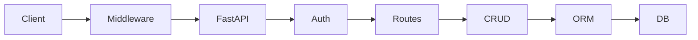

# EventHub – Presentation Slides Outline

**COMP3011 CW1 – Oral Presentation (5 minutes + 5 mins Q&A)**

---

## Slide 1: Title

**EventHub: Event & RSVP API**

- Nathaniel Sebastian (sc232ns)
- COMP3011 Web Services and Web Data
- 5th February 2026

*Live demo: comp3011-cw1-api.onrender.com*

---

## Slide 2: Problem & Solution

**Problem:**
- Student societies need to manage event registrations
- Track RSVPs, capacity, and attendance patterns

**Solution:**
- RESTful API with JWT authentication
- Full CRUD for Events, Attendees, RSVPs
- **Novel:** External data import + Analytics + Security hardening

---

## Slide 3: Architecture Overview

**[INSERT ARCHITECTURE DIAGRAM]**



**Key decisions:**
- Layered architecture (thin routes, fat CRUD)
- Middleware: rate limiting, request IDs, ETag
- SQLite for dev, PostgreSQL for prod

---

## Slide 4: Data Model (ERD)

**[INSERT ERD DIAGRAM]**

Key entities:
- User (with `is_admin` flag), Event, Attendee, RSVP
- **NEW:** DataSource, ImportRun (provenance tracking)

**Invariants:**
- RSVP unique constraint (event_id, attendee_id)
- Event provenance via source_record_id

---

## Slide 5: Novel Data Integration

**What makes this "Outstanding":**

1. **Import pipeline** (`scripts/import_dataset.py`)
   - Reads XML from Leeds City Council
   - Computes SHA256 hash for provenance
   - Logs ImportRun statistics

2. **Idempotent design**
   - Re-running updates existing records
   - Uses source_record_id for deduplication

3. **Provenance tracking**
   - Every imported event links to its source
   - Audit trail in import_runs table

---

## Slide 6: Analytics Endpoints

**Three novel endpoints:**

| Endpoint | Purpose |
|----------|---------|
| `/analytics/events/seasonality` | Monthly event counts |
| `/analytics/events/trending` | Score by recent RSVPs |
| `/events/recommendations` | Personalised suggestions |

**Trending formula:**
```
score = (recent_rsvps × 1.5) + (total_rsvps × 0.5)
```

---

## Slide 7: Security Hardening (Beyond Baseline)

| Feature | Implementation |
|---------|---------------|
| **RBAC** | `is_admin` flag; `/admin/*` returns 403 for non-admin |
| **Rate Limiting** | 120/min global, 10/min login → 429 with request_id |
| **Request Tracing** | `X-Request-ID` on all responses (including errors) |
| **Security Headers** | nosniff, DENY, no-store |
| **ETag Caching** | If-None-Match → 304 Not Modified |
| **Error Sanitization** | 500s show generic message, no stack traces |

---

## Slide 8: Testing & Quality

**39 tests passing:**
- Auth: 6 tests (register, login, edge cases)
- Events: 5 tests (CRUD, pagination)
- RSVPs: 4 tests (create, duplicate rejection)
- Analytics: 4 tests (seasonality, trending, recommendations)
- Admin/Import: 3 tests (idempotency, provenance)
- RBAC/Security: 2 tests (admin-only access, 403 Forbidden)
- Middleware: 2 tests (security headers, rate limiting 429)
- Attendees: 4 tests
- Health: 1 test (metadata endpoint)
- ETag: 3 tests (generation, 304, mismatch)
- Error Handling: 1 test (sanitization)

**Test isolation:**
- In-memory SQLite with StaticPool
- Fresh tables per test
- <1.5s total runtime

---

## Slide 9: Version Control Evidence

**[INSERT GIT LOG SCREENSHOT]**

**Commit history highlights:**
- Incremental development with meaningful messages
- Feature branches for major work

**Example commits:**
- `feat: Add novel data integration tables`
- `fix(mw): request-id + headers on all responses`
- `test(etag): add tests for 304 behaviour`

---

## Slide 10: All Deliverables

| Deliverable | Location |
|-------------|----------|
| GitHub Repo | github.com/NathS04/comp3011-cw1-api |
| Live API | comp3011-cw1-api.onrender.com |
| API Docs (PDF) | docs/API_DOCUMENTATION.pdf |
| Technical Report | TECHNICAL_REPORT.pdf |
| Presentation | docs/PRESENTATION_SLIDES.pptx |
| GenAI Logs | docs/GENAI_EXPORT_LOGS.pdf |

---

## Slide 11: GenAI Usage

**Tools:** Google Gemini (Antigravity), Claude, ChatGPT

**How I used AI:**
- Architecture exploration (RSVP table vs embedded)
- Scaffolding and debugging
- Security hardening (RBAC, rate limiting, ETag)
- Documentation drafting

**Critical evaluation:**
- Caught missing dependency (`requests`)
- Fixed placeholder test logic
- Updated deprecated API usage

*Full logs: docs/GENAI_EXPORT_LOGS.pdf*

---

## Slide 12: Limitations & Future Work

**Current limitations:**
- 30-min token expiry, no refresh
- In-memory rate limiting (no shared state across workers)
- No CSP header for XSS mitigation

**Future roadmap:**
- Redis-backed rate limiting
- Refresh token implementation
- Celery scheduled imports
- Content-Security-Policy header

---

## Slide 13: Live Demo

**Demo flow (if time):**
1. Show Swagger UI at /docs
2. Register → Login → Create event
3. Create attendee → RSVP
4. Show /events/{id}/stats
5. Show /analytics/events/trending
6. Demonstrate 304 Not Modified with ETag

*Backup: Screenshots in slides*

---

## Slide 14: Viva Preparation (Q&A Cheat Sheet)

| Question | Answer |
|----------|--------|
| **Why JWT over sessions?** | Stateless suits REST; no Redis needed; 30-min expiry mitigates risk |
| **How does idempotency work?** | `source_record_id` unique constraint; upsert logic updates existing |
| **How does trending scoring work?** | `(recent_rsvps × 1.5) + (total_rsvps × 0.5)` |
| **What would you change for production?** | Redis rate limiting, refresh tokens, CSP header, proper monitoring |
| **Why ETag caching?** | Demonstrates HTTP standards knowledge; saves bandwidth; RFC 7232 compliant |
| **How does RBAC work?** | `is_admin` boolean on User; `get_current_admin_user` dependency returns 403 |
| **How do you promote a user to admin?** | `python scripts/make_admin.py <username>` |
| **Why in-memory rate limiting?** | Acceptable for coursework; documented Redis as production upgrade |
| **How do you avoid leaking exceptions?** | Middleware catch-all returns generic message + request_id; stack trace logged server-side |
| **Why X-Request-ID?** | Correlates logs/errors; included in 429/500 JSON for debugging |
| **How did AI help?** | Architecture exploration, scaffolding—always reviewed before commit |
| **What did AI get wrong?** | Missing `requests` dep, placeholder test, deprecated Query usage |

---

## Slide 15: Thank You

**Questions?**

- Live API: comp3011-cw1-api.onrender.com
- Swagger: /docs
- Contact: sc232ns@leeds.ac.uk

---

*Presentation outline for COMP3011 CW1 – 5th February 2026*
